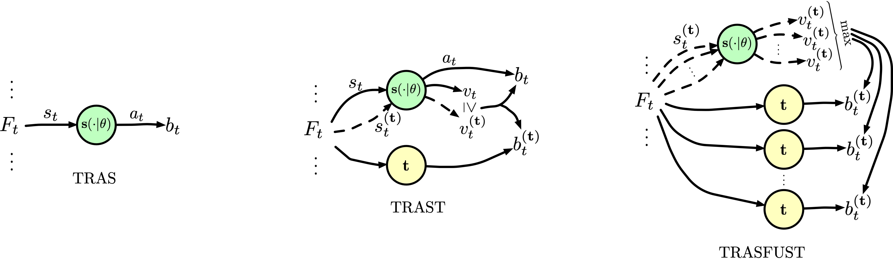
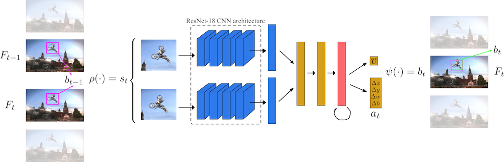

# Tracking-by-Trackers
[](https://paperswithcode.com/sota/visual-object-tracking-on-otb-2015?p=a-distilled-model-for-tracking-and-tracker)

[](https://paperswithcode.com/sota/visual-object-tracking-on-uav123?p=a-distilled-model-for-tracking-and-tracker)

[](https://paperswithcode.com/sota/visual-object-tracking-on-got-10k?p=a-distilled-model-for-tracking-and-tracker)

Official implementation of the tracking-by-trackers framework proposed in the paper
**"Tracking-by-Trackers with a Distilled and Reinforced Model"** (presented at the Asian Conference on Computer Vision 2020).

In particular, the repository contains the official implementation of the **TRAS**, **TRAST**, **TRASFUST** (ACCV 2020), and **A3CT**, **A3CTD** (ICCVW 2019) trackers, including trained models, and raw results. 

### TRAS, TRAST, TRASFUST
**[[Paper]](https://openaccess.thecvf.com/content/ACCV2020/html/Dunnhofer_Tracking-by-Trackers_with_a_Distilled_and_Reinforced_Model_ACCV_2020_paper.html)  [[Qualitative results]](https://youtu.be/uKtQgPk3nCU) [[Raw results]](https://drive.google.com/drive/folders/1Ppj9VIQ6n0KavnaZ2E1S-pKFSrRjQGuW?usp=sharing) [[Pretrained Model]](https://drive.google.com/file/d/1-ijK1kIqpBlSFTbPYNA9Ddfkgn3qrgSI/view?usp=sharing)**
  



### A3CT, A3CTD
**[[Paper]](https://openaccess.thecvf.com/content_ICCVW_2019/html/VOT/Dunnhofer_Visual_Tracking_by_Means_of_Deep_Reinforcement_Learning_and_an_ICCVW_2019_paper.html)  [[Qualitative results]](https://youtu.be/jSGLafk4-G4)
  [[Pretrained Model]](https://drive.google.com/file/d/1UotexDsuXLwQAx7mTnCf-iEL2QD0Om8d/view?usp=sharing)**
     



## Installation

Code has been developed and tested on Ubuntu 18.04 with Python 3.6, PyTorch 1.4.0, and CUDA 10.

#### Clone the GIT repository.  
```bash
git clone https://github.com/dontfollowmeimcrazy/vot-kd-rl.git
```

#### Set paths to checkpoint. 
Download the pretrained weights file from [here](https://drive.google.com/file/d/1-ijK1kIqpBlSFTbPYNA9Ddfkgn3qrgSI/view?usp=sharing), put wherever you want in your file system, and set the variable ```CKPT_PATH``` variable (contained in file ```track/config_track_accv.py```) to point to it.
   
## Test

#### Set path to benchmark datasets.  
In the file ```track/config_track_accv.py``` set the variable ```DATA_PATH``` to the location of the benchmark datasets (if you do not have them on your machine they will be automatically downloaded by the toolkit at the specified ```DATA_PATH```).

Run the script track/run_test.py by specifing the tracker with the ```--tracker``` option and the dataset with the ```--dataset```.
```bash
cd track
python run_test.py --tracker TRAS --dataset OTB2015  
```  

For the TRAST, TRASFUST, and A3CTD trackers you either need to:
	+ provide the implementation of "teacher" trackers according to the [GOT-10k toolkit](https://github.com/got-10k/toolkit) tracker class definition, and initialize them in lines [103](https://github.com/dontfollowmeimcrazy/vot-kd-rl/blob/1210631b0d1d5977cf8f0c872a47aff3041eef21/track/Trackers.py#L103) and [232](https://github.com/dontfollowmeimcrazy/vot-kd-rl/blob/1210631b0d1d5977cf8f0c872a47aff3041eef21/track/Trackers.py#L232) of the ```track/Trackers.py``` file.
	+ use the precomputed results of the "teacher" trackers. In this case, you have to specify the variable ```RESULTS_PATH``` which should point to the results folder used by the [GOT-10k toolkit](https://github.com/got-10k/toolkit). Results should be organised as given by the toolkit (e.g. ```benchmark-name/tracker-name/*.txt```). Some examples are given in the folder ```trackers/results/*``` for the OTB2015 results of ECO, MDNet, and SiamFC trackers.

## Training
Training code will be released soon!


## References
If you find this work useful please cite
```
@InProceedings{Dunnhofer_2020_ACCV,
	author    = {Dunnhofer, Matteo and Martinel, Niki and Micheloni, Christian},
	title     = {Tracking-by-Trackers with a Distilled and Reinforced Model},
	booktitle = {Proceedings of the Asian Conference on Computer Vision (ACCV)},
	month     = {November},
	year      = {2020}
}

@InProceedings{Dunnhofer_2019_ICCVW,
	author 	  = {Dunnhofer, Matteo and Martinel, Niki and Luca Foresti, Gian and Micheloni, Christian},
	title 	  = {Visual Tracking by Means of Deep Reinforcement Learning and an Expert Demonstrator},
	booktitle = {Proceedings of the IEEE/CVF International Conference on Computer Vision (ICCV) Workshops},
	month 	  = {Oct},
	year 	  = {2019}
}   
``` 

### Acknowledgements 

Code for evaluation was borrowed from the [GOT-10k toolkit](https://github.com/got-10k/toolkit).
